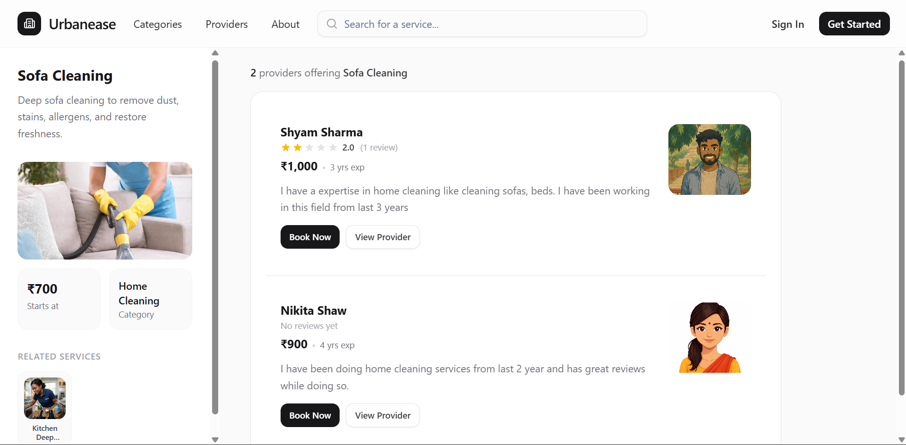

# Urbanease



**Book trusted home services at your fingertips.** From cleaning to carpentry — verified professionals, transparent pricing, flexible slots.

A full-stack home services platform connecting customers with service providers. Built with Next.js, Bun, Express, and PostgreSQL.

---

## Quick Start

```bash
# Backend (requires PostgreSQL + .env)
cd backend && bun install && bunx --bun prisma migrate dev && bun run dev

# Frontend (in another terminal)
cd frontend && bun install && bun run dev
```

Backend: `http://localhost:4000` · Frontend: `http://localhost:3000`


## Tech Stack

 Layer   | Stack                         
 Frontend| Next.js 16, React 19, Tailwind, shadcn/ui, TanStack Query |
 Backend | Bun, Express 5, Prisma 7     
 Database| PostgreSQL                    
 Auth    | JWT, HTTP-only cookies        
 Storage | S3-compatible (tigris)        

---

## Roles

- **Customer** — Browse, book, manage addresses, leave reviews
- **Provider** — Manage profile, services, areas, bookings
- **Admin** — Categories, services, areas, provider approval, review moderation